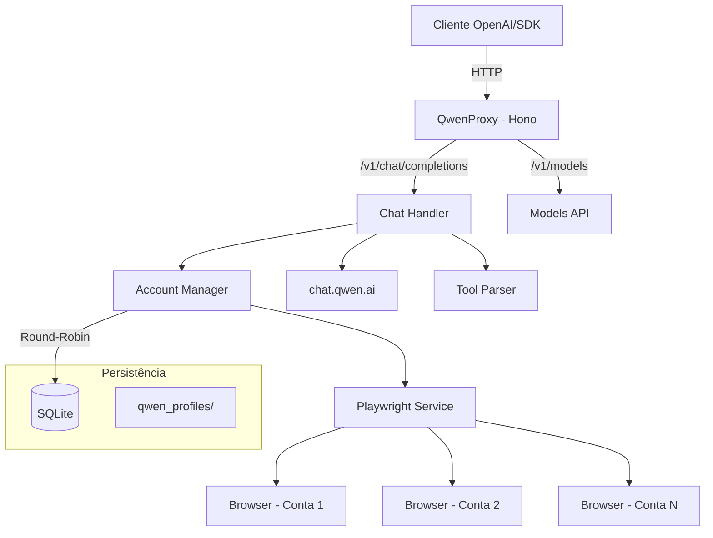

# QwenProxy

Proxy API local compatível com OpenAI que roteia requisições para os modelos do **Qwen (chat.qwen.ai)** via automação de navegador com Playwright. Suporte a múltiplas contas com rotação automática, execução de ferramentas, modo de pensamento (reasoning), persistência de sessão e armazenamento em SQLite.

[](https://github.com/pedrofariasx/qwenproxy/actions/workflows/ci.yml)
[](https://www.typescriptlang.org/)
[](https://hono.dev/)
[](https://playwright.dev/)
[](LICENSE)

---

## Features

- **OpenAI API Compatible** — Interface compatível com `/v1/chat/completions`, `/v1/models` e `/v1/upload`.
- **Multi-Account** — Gerencie múltiplas contas Qwen com rotação round-robin e cooldown automático.
- **Guest Mode** — Modo convidado sem necessidade de login, usando a API pública do Qwen.
- **SQLite Storage** — Contas salvas em banco de dados SQLite (WAL mode) para performance e confiabilidade.
- **Reasoning Support** — Suporte completo ao modo de pensamento (thinking) dos modelos Qwen.
- **Multimodal Upload** — Envio de imagens, vídeos, áudios e documentos via `/v1/upload` com integração ao OSS do Qwen.
- **Tool Execution** — Sistema de execução de ferramentas locais integrado ao fluxo do chat.
- **Session Persistence** — Perfil de navegador persistente por conta em `qwen_profiles/`.
- **Auto-Login** — Login automático via credenciais com recuperação de sessão.
- **Browser Selection** — Escolha entre Chromium, Chrome, Brave, Firefox, Edge ou WebKit.
- **Monitoring** — Health check, métricas Prometheus e watchdog integrados.
- **CLI Binary** — Instale globalmente via npm e use o comando `qwenproxy` diretamente.
- **Docker Ready** — Deploy para VPS com Docker, volumes persistentes e graceful shutdown.

---

## Arquitetura



---

## Pré-requisitos

| Dependência | Versão Mínima | Instalação |
|------------|--------------|-----------|
| Node.js | v20.x | [nvm](https://github.com/nvm-sh/nvm) |
| npm | v9.x | Incluído com Node.js |
| Playwright | - | `npx playwright install` |
| Docker (opcional) | v24.x | [Docker Docs](https://docs.docker.com/get-docker/) |

---

## Instalação

### Via npm (Global)

```bash
npm install -g @pedrofariasx/qwenproxy
npx playwright install
qwenproxy
```

### Via npm (Local)

```bash
git clone https://github.com/pedrofariasx/qwenproxy.git
cd qwenproxy
npm install
npx playwright install
```

### Via Docker

```bash
docker-compose up -d
```

---

## Configuração

Crie o arquivo `.env` na raiz do projeto (veja `.env.example`):

```env
# Porta do servidor (default: 3000)
PORT=3000

# Host do servidor (default: 0.0.0.0)
HOST=0.0.0.0

# Chave de API para proteger os endpoints (opcional)
API_KEY=sua-chave-secreta-aqui

# Credenciais Qwen para login automático (modo single-account)
QWEN_EMAIL=seu-email@exemplo.com
QWEN_PASSWORD=sua-senha-aqui

# Modo convidado - sem login, usa API pública (default: false)
QWEN_GUEST_MODE_ONLY=false

# Navegador (chromium, firefox, chrome, edge, webkit, brave)
# IMPORTANTE: use o MESMO navegador com que a sessão foi criada (login manual / [E]).
# Se a sessão veio do Brave real, use BROWSER=brave.
BROWSER=brave

# Caminho do executável do Brave (opcional, usado quando BROWSER=brave)
# BRAVE_PATH=/usr/bin/brave-browser

# Fingerprint do runtime: auto (default) | true | false
# auto: forja fingerprint apenas nos engines embutidos (chromium/firefox/webkit);
#       para navegadores reais instalados (brave/chrome/edge) mantém o fingerprint REAL,
#       alinhado com a sessão criada no login — evita o TMD responder 200 vazio.
# true: sempre forja (comportamento antigo). false: nunca forja.
FORGE_FINGERPRINT=auto

# Cooldown (em horas) aplicado quando o Qwen reporta rate limit SEM o aviso
# "Wait about N hour(s)". Quando o aviso existe, ele sempre vence. (default: 24)
RATE_LIMIT_COOLDOWN_HOURS=24

# Executar navegador sem interface gráfica (default: true)
HEADLESS=true

# Timeouts (milissegundos)
NAVIGATION_TIMEOUT=45000
PAGE_TIMEOUT=30000
HTTP_TIMEOUT=30000
HEADERS_TIMEOUT=60000
CHAT_TIMEOUT=120000
STREAM_IDLE_TIMEOUT=180000
```

---

## Gerenciamento de Contas

As contas são armazenadas em SQLite (`data/qwenproxy.db`). Use o CLI interativo para gerenciar:

```bash
# Abrir o gerenciador de contas
npm run login

# Com navegador específico
npm run login:firefox
npm run login:chrome
npm run login:edge
npm run login:brave
```

> **Dica anti-bot:** se o login manual apresentar mensagem de navegador não seguro / não confiável (verificação TMD do Alibaba), use `npm run login:chrome` ou `npm run login:brave`. O Chromium embutido do Playwright é facilmente detectado; um navegador real instalado (Chrome/Brave) passa muito mais fácil. No Brave, se o executável não for encontrado automaticamente, defina `BRAVE_PATH` no `.env`.
>
> O login manual agora abre o navegador com **perfil persistente** (`qwen_profiles/manual_login/`), acumulando histórico/localStorage entre execuções e apresentando o fingerprint real do navegador — sem forjar Windows/Chrome, o que evita inconsistências detectáveis.

O menu interativo permite:
- **[A]** Adicionar conta com credenciais (email + senha)
- **[M]** Adicionar conta via login manual no navegador
- **[E]** Importar sessão de um navegador real já aberto (contorna o anti-bot TMD)
- **[R]** Remover uma conta
- **[L]** Login em todas as contas (inicializar sessões)

> **Importar sessão do navegador real (opção [E]):** quando o anti-bot do Qwen
> (TMD) recusa a janela de login automatizada com "navegador não confiável", a
> forma mais confiável é logar no **seu próprio navegador** e importar os cookies
> frescos. O CLI detecta a porta de debug e, se necessário, abre o Brave
> automaticamente com `--remote-debugging-port=9222` (se o Brave já estiver
> aberto, feche-o primeiro — o Chromium ignora essa flag quando outra instância
> está rodando). Entre em `https://chat.qwen.ai`, faça login normalmente, volte
> ao CLI e a sessão será importada para `qwen_profiles/<id>_state.json`. Isso
> funciona porque o TMD nunca vê automação — vê apenas um navegador real de
> usuário logado.

> Na primeira execução, se existir um `accounts.json` antigo, as contas serão migradas automaticamente para SQLite.

---

## Uso

### Iniciar o servidor

```bash
npm start                  # Chromium (padrão)
npm run start:chrome       # Google Chrome
npm run start:firefox      # Firefox
npm run start:edge         # Microsoft Edge
npm run start:brave        # Brave Browser
```

O servidor inicia em `http://localhost:3000` com as seguintes rotas:

| Rota | Método | Descrição |
|------|--------|-----------|
| `/v1/chat/completions` | POST | Chat completions (streaming + non-streaming) |
| `/v1/chat/completions/stop` | POST | Abortar uma geração ativa |
| `/v1/models` | GET | Listar modelos disponíveis |
| `/v1/models/:model` | GET | Informações de um modelo específico |
| `/v1/upload` | POST | Upload de arquivos multimodais (imagens, vídeos, áudios, documentos) |
| `/health` | GET | Health check com status do sistema |
| `/accounts/status` | GET | Mostra cada conta e se está **rate-limited** (bateu o limite diário) ou disponível |
| `/metrics` | GET | Métricas no formato Prometheus |

---

## Exemplos de Integração

### OpenAI SDK (Node.js)

```typescript
import OpenAI from 'openai';

const openai = new OpenAI({
  baseURL: 'http://localhost:3000/v1',
  apiKey: process.env.API_KEY || 'sk-no-key-required'
});

const completion = await openai.chat.completions.create({
  model: 'qwen-plus',
  messages: [{ role: 'user', content: 'Explique como funciona o Playwright.' }]
});

console.log(completion.choices[0].message.content);
```

### cURL

```bash
curl http://localhost:3000/v1/chat/completions \
  -H "Content-Type: application/json" \
  -H "Authorization: Bearer sua-chave" \
  -d '{
    "model": "qwen-plus",
    "messages": [{"role": "user", "content": "Hello!"}],
    "stream": true
  }'
```

---

## Deploy com Docker

### docker-compose.yml

```yaml
services:
  qwenproxy:
    build: .
    container_name: qwenproxy
    ports:
      - "${PORT:-3000}:3000"
    env_file:
      - .env
    volumes:
      - qwenproxy_data:/app/data
      - qwenproxy_profiles:/app/qwen_profiles
    restart: unless-stopped
    logging:
      driver: "json-file"
      options:
        max-size: "10m"
        max-file: "3"

volumes:
  qwenproxy_data:
  qwenproxy_profiles:
```

### Volumes persistentes

| Volume | Conteúdo |
|--------|----------|
| `qwenproxy_data` | Banco SQLite com as contas (`qwenproxy.db`) |
| `qwenproxy_profiles` | Perfis de navegador por conta (cookies, sessões) |

O container ajusta automaticamente as permissões desses volumes no startup. Se usar bind mounts locais em vez dos volumes nomeados acima, garanta que os diretórios montados sejam graváveis pelo container.

---

## Estrutura do Projeto

```
qwenproxy/
├── bin/
│   └── qwenproxy.mjs            # Entry point do CLI binário
├── src/
│   ├── index.ts                 # Entry point do servidor
│   ├── login.ts                 # CLI de gerenciamento de contas
│   ├── api/
│   │   ├── models.ts            # Endpoints /v1/models
│   │   └── server.ts            # Servidor Hono + startup
│   ├── cache/
│   │   └── memory-cache.ts      # Cache em memória com TTL
│   ├── core/
│   │   ├── account-manager.ts   # Rotação round-robin + cooldowns
│   │   ├── accounts.ts          # CRUD de contas (SQLite)
│   │   ├── config.ts            # Configuração com Zod
│   │   ├── crypto-utils.ts      # Criptografia de senhas em repouso
│   │   ├── database.ts          # Conexão e migrations SQLite
│   │   ├── logger.ts            # Logger estruturado
│   │   ├── metrics.ts           # Coleta de métricas Prometheus
│   │   ├── model-registry.ts    # Registro de modelos e context windows
│   │   ├── stream-registry.ts   # Tracking de streams ativos
│   │   └── watchdog.ts          # Health monitoring
│   ├── routes/
│   │   ├── chat.ts              # Handler /v1/chat/completions
│   │   ├── sse-parser.ts        # Parser incremental de SSE + delta
│   │   ├── stream-handler.ts    # Orquestração de streaming SSE
│   │   ├── tool-handler.ts      # Execução de tools locais
│   │   └── upload.ts            # Handler /v1/upload (multimodal)
│   ├── services/
│   │   ├── browser-manager.ts   # Ciclo de vida de browsers/contexts
│   │   ├── error-handler.ts     # Tipagem e retry de erros Qwen
│   │   ├── header-interceptor.ts # Captura de cookies/headers via CDP
│   │   ├── playwright.ts        # Fachada do serviço Playwright
│   │   ├── qwen.ts              # Integração com API do Qwen
│   │   ├── stealth.ts           # Script anti-detecção
│   │   ├── stream-bridge.ts     # Ponte de stream browser → Node
│   │   ├── stream-creator.ts    # Criação de chats e streams Qwen
│   │   └── warm-pool.ts         # Pool de chats pré-aquecidos
│   ├── tests/                   # Testes automatizados (node:test)
│   ├── tools/
│   │   ├── parser.ts            # Parser de <tool_call> tags
│   │   ├── registry.ts          # Registro de tools
│   │   ├── schema.ts            # Validação JSON Schema
│   │   └── types.ts             # Tipos do sistema de tools
│   └── utils/
│       ├── context-truncation.ts # Truncamento de contexto
│       ├── json.ts              # Parser JSON robusto
│       ├── qwen-stream-parser.ts # Parser de streams SSE do Qwen
│       └── types.ts             # Re-exports de tipos
├── data/                        # Banco SQLite (gitignored)
├── qwen_profiles/               # Perfis de navegador por conta (gitignored)
├── Dockerfile
├── docker-compose.yml
├── tsconfig.json
├── tsconfig.build.json
└── package.json
```

---

## Troubleshooting

| Problema | Solução |
|----------|---------|
| Porta em uso | Altere `PORT` no `.env` ou encerre o processo na porta 3000 |
| Navegador não abre | Execute `npx playwright install` |
| Sessão expirada | Execute `npm run login` para renovar cookies |
| Erro `200 OK` vazio em todas as requisições (anti-bot TMD silencioso) | O fingerprint do runtime não bate com o da sessão. Se a sessão foi criada no Brave real ([E]), use `BROWSER=brave` (e `FORGE_FINGERPRINT=auto`, o default) para o runtime apresentar o fingerprint real. Forjar Chrome/Windows numa sessão criada em Brave/Linux faz o TMD responder 200 vazio. Depois reinicie o servidor; se persistir, renove a sessão com `npm run login` → **[E]** |
| "Navegador não seguro" no login manual | Use a opção **[E]** `npm run login` — faça login no seu navegador real e importe a sessão via `--remote-debugging-port=9222` |
| Rate limit em todas as contas | Adicione mais contas via `npm run login` |
| Conta com limite diário estourado continua sendo usada | O proxy agora detecta o erro de rate limit em **todos** os pontos (antes do stream, durante o stream e no warm pool), marca a conta com cooldown e pula para a próxima. Verifique o estado de cada conta em `GET /accounts/status` |
| Banco corrompido | Apague `data/qwenproxy.db` e re-adicione as contas |

---

## Disclaimer

> Este projeto é fornecido estritamente para fins educacionais e de pesquisa.

Os autores não incentivam ou endossam:
- Violação dos Termos de Serviço da plataforma Qwen.
- Automação não autorizada em larga escala.
- Uso para atividades maliciosas.

**Use por sua conta e risco.**
